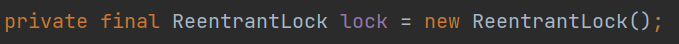
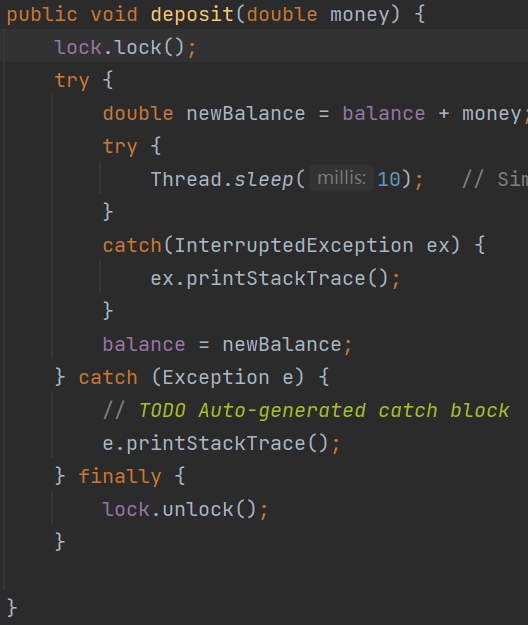
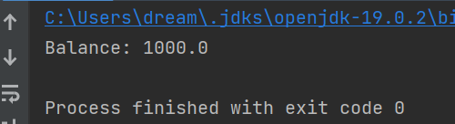

# Lab7 Report
Author: 11910507陈梓涵
## Use synchronized keyword
In the Test, it create 100 thread each to store about 10 dollars. The only method restoring dollar and changing the balance is `deposit`.
So Add `synchronized` key before the `deposit`.

The Result is 1000.0 dollars.

## Use ReentrantLock
Similarly, use the `ReentrantLock` need us to create a lock.

Then Add lock on the deposit method.

The Result is also 1000.0 dollars.

